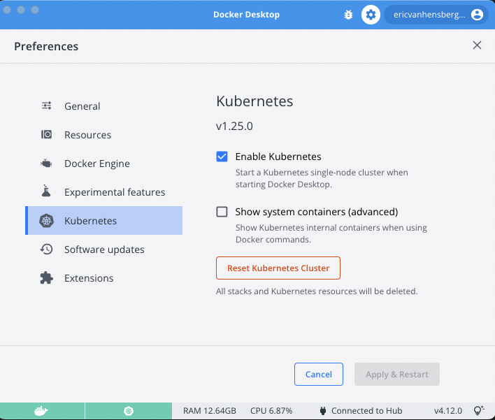
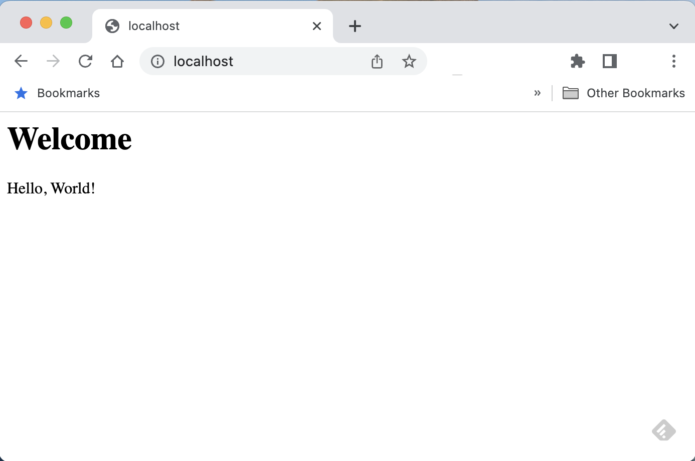
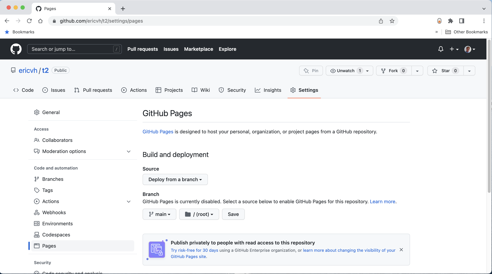
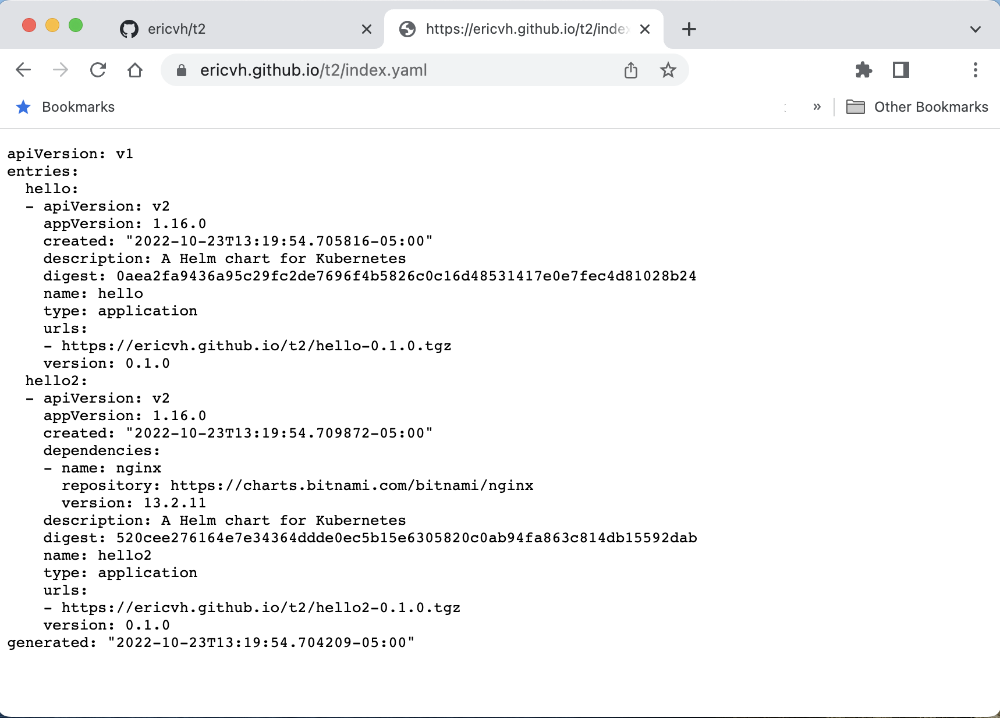

# LFEdge Catalog Proposal

Catalog of LFedge demos and stacks.

Original idea documented [on LFEdge wiki](https://wiki.lfedge.org/display/LE/LF+Edge+Catalog)

## Tutorial

We are currently exploring two different modes of deployment, helm charts for kubernetes based deployments and docker-compose for container based deployments

### Getting Started

If you don't already have a kubernetes cluster, we suggest installing Docker Desktop which seems to provide the easiest and most uniform environment across Mac, Windows, and Linux.

- Go to <https://www.docker.com/products/docker-desktop/> and install docker desktop for your platform
- Once it is installed, open it's preferences and enable Kubernetes support:



- Wait for kubernetes to install and come up, the kubernetes icon on the bottom of the Docker Desktop should be green
- Open a shell to test the kubernetes installation
- Verify kubernetes is running and configured properly:

```console
$ kubectl cluster-info
Kubernetes control plane is running at https://kubernetes.docker.internal:6443
CoreDNS is running at https://kubernetes.docker.internal:6443/api/v1/namespaces/kube-system/services/kube-dns:dns/proxy

To further debug and diagnose cluster problems, use kubectl cluster-info dump.
```

### Your first helm chart

You can create a simple helm chart using the helm command:

```console
$ helm create hello
Creating hello
$ ls hello
Chart.yaml      charts          templates       values.yaml
```

The starter chart is a simple NGINX deployment.  The metadata for the chart is in _Chart.yaml_ with customization variables in _values.yaml_, the underlying templates which will create the kubernetes yaml files are in the _templates_ sub-directory.  For more information on Helm charts, simply read the [documentation](https://helm.sh/docs).

To deploy this simple chart, you need to just provide it a name.  As a convienence we'll customize it from the command line to use the _LoadBalancer_ service.type which makes it easier to access the results from your local web browser.  We could have also made this customization by editing values.yaml.

```console
$ helm install --set service.type=LoadBalancer example hello
NAME: example
LAST DEPLOYED: Sun Oct 23 11:20:58 2022
NAMESPACE: default
STATUS: deployed
REVISION: 1
NOTES:
1. Get the application URL by running these commands:
     NOTE: It may take a few minutes for the LoadBalancer IP to be available.
           You can watch the status of by running 'kubectl get --namespace default svc -w example-hello'
  export SERVICE_IP=$(kubectl get svc --namespace default example-hello --template "{{ range (index .status.loadBalancer.ingress 0) }}{{.}}{{ end }}")
  echo http://$SERVICE_IP:80
```

In most cases, SERVICE_IP should just be localhost, so once the helm chart finishes installing you should be able to access the resulting web page by pointing your web browser at <http://localhost>


When you are done, you can uninstall the chart via the command line to cleanup:

```console
$ helm uninstall example
release "example" uninstalled
```

### Creating custom templates and parameters

If you look at the contents of the simple values.yaml file, you'll see there are quite a few customization options and it can be a bit overwhelming.  What we want to create is a much more approachable configuration by using a simple chart which only allows us to customize the content.  We'll do this by creating a second chart, have it reference the bitnami NGINX chart as a dependency, and then create a template for a configmap to provide the content based on values from _values.yaml_.

- Create a new starter chart, remove the starter templates and starter values

```console
$ helm create hello2
Creating hello2
$ rm -rf hello2/templates/*
$ echo > hello2/values.yaml
```

- specify a dependency on the bitnami NGINX chart and download the packaged version into _charts_

```console
$ cat <<EOF >> hello2/Chart.yaml
dependencies:
- name: nginx
  repository: "https://charts.bitnami.com/bitnami/nginx"
  version: 13.2.11
EOF
$ helm dependency build hello2 
Getting updates for unmanaged Helm repositories...
...Successfully got an update from the "https://charts.bitnami.com/bitnami/nginx" chart repository
Hang tight while we grab the latest from your chart repositories...
...Successfully got an update from the "bitnami" chart repository
Update Complete. ⎈Happy Helming!⎈
Saving 1 charts
Downloading nginx from repo https://charts.bitnami.com/bitnami/nginx
Deleting outdated charts
```

- Now add a template for the customized content to the templates, and an initial custom value to values.yaml

```console
$ cat <<EOF > hello2/templates/configmap.yaml
apiVersion: v1
kind: ConfigMap
metadata:
  name: hello-configmap
data: 
  index.html: |
    <html>
    <body>
    <h1>Welcome</h1>
    <P>{{ .Values.content }}</P>
    </body>
    </html>
EOF
```

- Finally customize values.yaml to add the content and configure the NGINX dependency to use that configmap:

```console
$ cat <<EOF > hello2/values.yaml
content: "Hello, World!"
nginx:
  staticSiteConfigmap: hello-configmap
EOF
```

- Try out your new chart

```console
$ helm install --set nginx.service.type=LoadBalancer example hello2
NAME: example
LAST DEPLOYED: Sun Oct 23 12:09:51 2022
NAMESPACE: default
STATUS: deployed
REVISION: 1
TEST SUITE: None
```

- Open up your browser again



- Update the message from the command line

```console
$ helm upgrade --set nginx.service.type=LoadBalancer --set content="Hello LFEdge" example hello2
NAME: example
LAST DEPLOYED: Sun Oct 23 12:09:51 2022
NAMESPACE: default
STATUS: deployed
REVISION: 1
TEST SUITE: None
```

- Reopen your browser (and beward cached content, you may have to force reload)
- For more information on helm tempaltes, follow the [Helm Template Tutorial](https://helm.sh/docs/chart_template_guide/getting_started/)
- If you are going to push your package to artifacthub.io (covered later in the tutorial), you should add a README.md to the chart directory and update Chart.yaml with artifact-hub specific metadata.  Its a good idea to provide quickstart instructions, quick configiure instructions, as well as long-form parameter lists in your README.md.

### Packaging and Publishing your helm charts

The easiest way to publish helm charts is to use a web site, you can even serve them from a subdirectory of an existing website.
We'll use a github pages project to serve the pages, but you can easily adapt this technique to another type of web host.

- Start by packaging the two helm charts we just created

```console
$ helm package hello
Successfully packaged chart and save
$ helm package hello2
```

(if you have a PGP key, go ahead and sign them by adding --sign)

```console
$ helm package --sign --key ericvh@gmail.com --keyring ~/.gnupg/secring.gpg hello
Password for key "Eric Van Hensbergen <ericvh@gmail.com>" >  
Successfully packaged chart and saved it to: /Users/erivan01/src/lfedge-catalog-proposal/examples/hello-0.1.0.tgz
```

- Create a new github project, populate it with a default README.md
- Go back to the github project settings (<https://github.com/user/project/settings/pages>) and setup pages by selecting the main branch and /root then click save



- Checkout the github project to your system and add the packaged charts

```console
$ git clone git@github.com:ericvh/lfedge-catalog.git # replace with your repo
Cloning into 'lfedge-catalog'...
remote: Enumerating objects: 26, done.
remote: Counting objects: 100% (26/26), done.
remote: Compressing objects: 100% (22/22), done.
remote: Total 26 (delta 1), reused 23 (delta 1), pack-reused 0
Receiving objects: 100% (26/26), 36.98 KiB | 425.00 KiB/s, done.
Resolving deltas: 100% (1/1), done.
$ mv *.tgz* lfedge-catalog
```

- create the index for the packaged charts (creating an index.yaml)

```console
helm repo index --url https://ericvh.github.io/lfedge-catalog lfedge-catalog
```

- add the new files, commit, and push back to gitlab

```console
$ cd lfedge-catalog
$ git add .
$ git commit -m 'Add charts'
[main b80030d] Add charts
 5 files changed, 91 insertions(+)
 create mode 100644 hello-0.1.0.tgz
 create mode 100644 hello-0.1.0.tgz.prov
 create mode 100644 hello2-0.1.0.tgz
 create mode 100644 hello2-0.1.0.tgz.prov
 create mode 100644 index.yaml
$ git push 
```

- Wait about a minute and then check to make sure the index.yaml is there: <https://ericvh.github.io/lfedge-catalog/index.yaml>



- Its also a good idea to add instructions to your Github pages README.md about how to access the charts:

````console
$ cat <<EOF > README.md
# lfedge-catalog

To use this catalog:
```
helm repo add lfedge https://ericvh.github.io/lfedge-catalog
helm update
```
EOF
$ git commit -a -m "Update README.md"
main b1f9470] Update README.md
 1 file changed, 9 insertions(+), 1 deletion(-)
$ git push
Enumerating objects: 5, done.
Counting objects: 100% (5/5), done.
Delta compression using up to 10 threads
Compressing objects: 100% (3/3), done.
Writing objects: 100% (3/3), 1.01 KiB | 1.01 MiB/s, done.
Total 3 (delta 1), reused 0 (delta 0), pack-reused 0
remote: Resolving deltas: 100% (1/1), completed with 1 local object.
To github.com:ericvh/t2.git
   b80030d..b1f9470  main -> main
````

- Any time you update or release your charts, just update the web page by adding to the git repo, re-indexing, and pushing.

## Adding charts to Artifacthub

Artifacthub acts as an index of many different types of resources including Helm charts.

- Go to <https://artifacthub.io> and setup a new user if you don't already have an account
- Click on your profile picture in the upper right hand corner and select control panel
- Click the Add button to add a new repository
- Give your repository a name, and point it at your github page you just created: <https://ericvh.github.io/lfedge-catalog>
- After a period of time (usually 15 minutes to a half an hour, it will scrape your charts and add them), then you can search for your packages and see them in the repo
- Follow artifacthub documentation to [add metadata](https://artifacthub.io/docs/topics/annotations/helm/), [prove ownership](https://artifacthub.io/docs/topics/repositories/), and add readme content to your package by including a README.md inside the package directory prior to its packaging.
